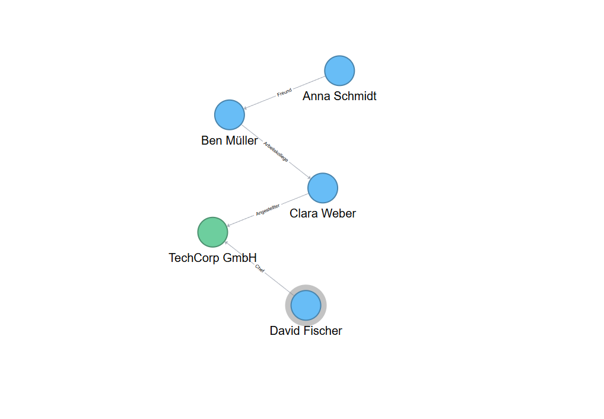

# d3neo4j.js

[Neo4j](https://github.com/neo4j) graph visualization using [D3.js](https://github.com/d3/d3).




## Running

```bash
> git clone https://github.com/zeus1999/neo4jd3.git
> npm install
```


## Documentation

### Options

| Parameter | Type | Description |
| --------- | ---- | ----------- |
| **highlight** | *array* | Highlight several nodes of the graph. Selection with Node Id.<br>Example:<br>`[`<br>&nbsp;&nbsp;&nbsp;&nbsp;`{`<br>&nbsp;&nbsp;&nbsp;&nbsp;&nbsp;&nbsp;&nbsp;&nbsp;`id: 'Pet-001'`<br>&nbsp;&nbsp;&nbsp;&nbsp;`}`<br>`]` |
| **infoPanel** | *boolean* | Show the information panel: `true`, `false`. Default: `true`. |
| **minCollision** | *int* | Minimum distance between nodes. Default: 2 * *nodeRadius*. |
| **neo4jData** | *object* | Graph data in [Neo4j data format](#neo4j-data-format). |
| **neo4jDataUrl** | *string* | URL of the endpoint that serves the graph data in [Neo4j data format](#neo4j-data-format). |
| **nodeRadius** | *int* | Radius of nodes. Default: 25. |
| **onNodeClick** | *function* | Callback function to be executed when the user clicks a node. |
| **onNodeDoubleClick** | *function* | Callback function to be executed when the user double clicks a node. |
| **onNodeDragEnd** | *function* | Callback function to be executed when the user finishes dragging a node. |
| **onNodeDragStart** | *function* | Callback function to be executed when the user starts dragging a node. |
| **onNodeMouseEnter** | *function* | Callback function to be executed when the mouse enters a node. |
| **onNodeMouseLeave** | *function* | Callback function to be executed when the mouse leaves a node. |
| **onRelationshipDoubleClick** | *function* | Callback function to be executed when the user double clicks a relationship. |
| **zoomFit** | *boolean* | Adjust the graph to the container once it has been loaded: `true`, `false`. Default: `false`. |
| **showNodeLabel** | *boolean* | Show the node labels: `true`, `false`. Default: `false`. |
| **nodeLabelFunction** | *function* | Show the node labels: `true`, `false`. Default: `false`. <br><br>Examples:<br>`node => node.name`<br>`node => node.id`<br>`node => node.id + " " + node.name`|


### Documentation

#### Example Data

```
{
    "results": [
        {
            "columns": [
                "user",
                "entity"
            ],
            "data": [
                {
                    "graph": {
                        "nodes": [
                            {
                                "id": "1001",
                                "name": "Anna Schmidt",
                                "labels": ["Person"],
                                "properties": {}
                            },
                            {
                                "id": "1002",
                                "name": "Ben Müller",
                                "labels": ["Person"],
                                "properties": {}
                            },
                            {
                                "id": "1003",
                                "name": "Clara Weber",
                                "labels": ["Person"],
                                "properties": {}
                            },
                            {
                                "id": "1004",
                                "name": "David Fischer",
                                "labels": ["Person"],
                                "properties": {}
                            },
                            {
                                "id": "2001",
                                "name": "TechCorp GmbH",
                                "labels": ["Unternehmen"],
                                "properties": {}
                            }
                        ],
                        "relationships": [
                            {
                                "id": "R100",
                                "type": "Freund",
                                "startNode": "1001",
                                "endNode": "1002",
                                "properties": {}
                            },
                            {
                                "id": "R101",
                                "type": "Arbeitskollege",
                                "startNode": "1002",
                                "endNode": "1003",
                                "properties": {}
                            },
                            {
                                "id": "R102",
                                "type": "Angestellter",
                                "startNode": "1003",
                                "endNode": "2001",
                                "properties": {}
                            },
                            {
                                "id": "R103",
                                "type": "Chef",
                                "startNode": "1004",
                                "endNode": "2001",
                                "properties": {}
                            }
                        ]
                    }
                }
            ]
        }
    ],
    "errors": []
}

```

### Example

<!-- Live example @ [https://zeus1999.github.io/d3neo4j/](https://zeus1999.github.io/d3neo4j/) -->

```javascript
new d3Neo4J('#neo4jd3', {
    highlight: [
        {
            id: "1004"
        }
    ],
    neo4jData: graphData,
    infoPanel: false,
    minCollision: 100,
    nodeRadius: 25,
    showNodeLabel: true,
    nodeLabelFunction: node => node.name
});
```


### Versions

    Tested in D3 Version 7.9.0


## License

Code released under the [MIT license](LICENSE).